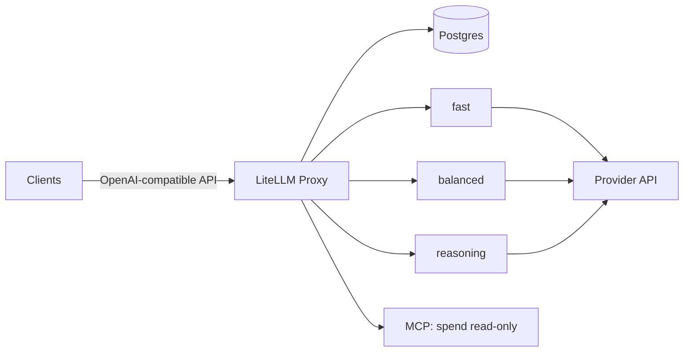

# LLM Gateway Blueprint

A deliberately generic companion repository for explaining how to build a self-hosted LLM gateway without publishing a production environment.

This repository is **not a sanitized clone** of a real deployment. It is a clean-room blueprint with synthetic names, localhost-only examples, placeholder credentials, and no inherited production Git history.

## What this demonstrates

- one OpenAI-compatible gateway in front of model providers
- Postgres-backed usage and spend tracking
- stable capability aliases instead of provider-specific model names
- fallback chains
- task-aware `auto` routing
- a read-only MCP service for spend queries
- application-level health checks and failure-oriented design
- a public-safe documentation pattern for infrastructure projects

The runnable baseline intentionally uses one OpenAI API key to keep the first run simple. The architecture is designed so `fast`, `balanced`, and `reasoning` can later map to different providers without changing clients.

## Architecture



The public example intentionally leaves out production network topology, personal integrations, hostnames, private addresses, account identifiers, backup destinations, and operational secrets.

## Repository tour

| Path | Purpose |
|---|---|
| `docker-compose.yml` | Minimal LiteLLM + Postgres + spend-MCP stack |
| `config/litellm.yaml` | Runnable model aliases, routing, fallbacks, and MCP registration |
| `src/auto_router.py` | Task-aware `auto` routing callback |
| `mcp/spend/` | Small read-only MCP example |
| `tests/` | Unit/config tests for routing, safety assumptions, and MCP helpers |
| `docs/build-log/` | Staged story for a blog series |
| `docs/security-boundary.md` | What belongs in the public twin and what never does |
| `scripts/public-safety-check.sh` | Pre-publication leak checks |

## Quick start

Prerequisites: Docker with Compose, an OpenAI API key, and a shell.

```bash
make setup
```

Edit `.env` and set:

- `OPENAI_API_KEY`
- a random `LITELLM_MASTER_KEY` that keeps the `sk-` prefix shown in `.env.example`
- a random local `POSTGRES_PASSWORD`

Then start the stack:

```bash
make up
```

Watch startup if needed:

```bash
make logs
```

Once the gateway is healthy, send a request through the `auto` alias:

```bash
make smoke
```

The gateway listens only on `127.0.0.1:4000` in this blueprint.

## Default capability aliases

The baseline uses currently documented OpenAI models so one provider credential is enough for the tutorial:

| Alias | Example backing model | Intended use |
|---|---|---|
| `fast` | `gpt-5-nano` | short/simple requests |
| `balanced` | `gpt-5-mini` | general work |
| `reasoning` | `gpt-5.1` | code, architecture, debugging, longer analysis |
| `auto` | rewritten by `src/auto_router.py` | client asks the gateway to choose |

These mappings are examples, not recommendations. Check current provider availability and pricing before using them. In a real multi-provider setup, each alias can point to several deployments and providers.

## Why `auto` is intentionally simple

The example router uses deterministic heuristics rather than another LLM call. That makes the policy easy to read, test, and discuss in a blog post.

Its important properties are architectural:

1. clients ask for a stable capability (`auto`), not a vendor SKU;
2. routing policy lives in one place;
3. non-chat requests are left untouched;
4. policy failures fail open instead of breaking the request;
5. routing decisions can later incorporate latency, cost, reliability, or an LLM classifier.

## Spend MCP

`mcp/spend` demonstrates a narrow operational tool: aggregate calls, tokens, and spend over a bounded time window.

It deliberately does **not** return prompts, responses, API keys, raw request metadata, or user identifiers.

For tutorial simplicity it uses the same Postgres credential as LiteLLM. A production deployment should create a separate database role with only the `SELECT` privileges the tool requires.

## Validate before publishing

Install development dependencies and run:

```bash
python -m pip install -r requirements-dev.txt
make safety
make test
```

GitHub Actions also runs:

- repository-specific leak checks
- `docker compose config` against `.env.example`
- Python compilation
- the unit/config test suite

Passing CI is a release gate, not a substitute for manually reviewing the public/private boundary.

## The build story

The repository is organized so the implementation can be explained as a sequence rather than as one giant architecture diagram:

1. **Foundation** — centralize provider access behind one API.
2. **Spend** — add persistent usage/cost data.
3. **Routing** — create capability aliases, fallbacks, and an `auto` tier.
4. **Tools** — expose safe read-only operational data over MCP.
5. **Reliability** — health checks, timeouts, graceful fallbacks, and failure visibility.
6. **Hardening** — least privilege, confirmation gates for writes, secret hygiene, and public/private separation.

See `docs/build-log/` for the staged notes.

## Public-repo rule

Treat this repository as documentation written **from the architecture outward**, never as production files copied **from the deployment inward**.

That one rule prevents most accidental disclosures.
